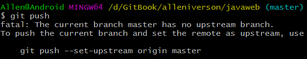

# 5.3 Git push与pull的默认行为

一直以来对`git push`与`git pull`命令的默认行为感觉混乱，今天抽空总结下。

## git push

通常对于一个本地的新建分支，例如`git checkout -b develop`, 在develop分支commit了代码之后，如果直接执行`git push`命令，develop分支将不会被push到远程仓库（但此时`git push`操作有可能会推送一些代码到远程仓库，这取决于我们本地 git config 配置中的`push.default`默认行为，下文将会逐一详解）。

因此我们至少需要显式指定将要推送的分支名，例如`git push origin develop`，才能将本地新分支推送到远程仓库。

当我们通过显式指定分支名进行初次push操作后，本地有了新的commit，此时执行`git push`命令会有什么效果呢？

如果你未曾改动过git config中的`push.default`属性，根据我们使用的git不同版本（Git 2.0之前或之后），`git push`通常会有两种截然不同的行为:

1. develop分支中本地新增的commit被push到远程仓库
2. push失败，并收到git如下的警告

```
fatal: The current branch new has no upstream branch.
To push the current branch and set the remote as upstream, use

    git push --set-upstream origin develop
```

为什么git版本不同会有两种不同的push行为？

因为在[git的全局配置中，有一个push.default](http://git-scm.com/docs/git-config)属性，其决定了`git push`操作的默认行为。在Git 2.0之前，这个属性的默认被设为matching，2.0之后则被更改为了simple。

我们可以通过`git version`确定当前的git版本（如果小于2.0，更新是个更好的选择），通过`git config --global push.default 'option'`改变push.default的默认行为（或者也可直接编辑~/.gitconfig文件）。

**push.default** 有以下几个可选值：**nothing, current, upstream, simple, matching**

其用途分别为：

- **nothing** - push操作无效，除非显式指定远程分支，例如`git push origin develop`（我觉得。。。可以给那些不愿学git的同事配上此项）。
- **current** - push当前分支到远程同名分支，如果远程同名分支不存在则自动创建同名分支。
- **upstream** - push当前分支到它的upstream分支上（这一项其实用于经常从本地分支push/pull到同一远程仓库的情景，这种模式叫做central workflow）。
- **simple** - simple和upstream是相似的，只有一点不同，simple必须保证本地分支和它的远程upstream分支同名，否则会拒绝push操作。
- **matching** - push所有本地和远程两端都存在的同名分支。

因此如果我们使用了git2.0之前的版本，push.default = matching，git push后则会推送当前分支代码到远程分支，而2.0之后，push.default = simple，如果没有指定当前分支的upstream分支，就会收到上文的fatal提示。

## upstream & downstream

说到这里，需要解释一下[git中的upstream到底是什么](http://stackoverflow.com/questions/2739376/definition-of-downstream-and-upstream)：

> git中存在upstream和downstream，简言之，当我们把仓库A中某分支x的代码push到仓库B分支y，此时仓库B的这个分支y就叫做A中x分支的upstream，而x则被称作y的downstream，这是一个相对关系，每一个本地分支都相对地可以有一个远程的upstream分支（注意这个upstream分支可以不同名，但通常我们都会使用同名分支作为upstream）。

初次提交本地分支，例如`git push origin develop`操作，并不会定义当前本地分支的upstream分支，我们可以通过`git push --set-upstream origin develop`，关联本地develop分支的upstream分支，另一个更为简洁的方式是初次push时，加入-u参数，例如`git push -u origin develop`，这个操作在push的同时会指定当前分支的upstream。

注意push.default = current可以在远程同名分支不存在的情况下自动创建同名分支，有些时候这也是个极其方便的模式，比如初次push你可以直接输入 git push 而不必显示指定远程分支。

## git pull

弄清楚`git push`的默认行为后，再来看看`git pull`。

当我们未指定当前分支的upstream时，通常`git pull`操作会得到如下的提示：

```
There is no tracking information for the current branch.
Please specify which branch you want to merge with.
See git-pull(1) for details

    git pull <remote> <branch>

If you wish to set tracking information for this branch you can do so with:

    git branch --set-upstream-to=origin/<branch> new1

```

`git pull`的默认行为和`git push`完全不同。当我们执行`git pull`的时候，实际上是做了`git fetch + git merge`操作，fetch操作将会更新本地仓库的remote tracking，也就是refs/remotes中的代码，并不会对refs/heads中本地当前的代码造成影响。

当我们进行pull的第二个行为merge时，对git来说，如果我们没有设定当前分支的upstream，它并不知道我们要合并哪个分支到当前分支，所以我们需要通过下面的代码指定当前分支的upstream：

```
git branch --set-upstream-to=origin/<branch> develop
// 或者git push --set-upstream origin develop
```

实际上，如果我们没有指定upstream，git在merge时会访问git config中当前分支(develop)merge的默认配置，我们可以通过配置下面的内容指定某个分支的默认merge操作

```
[branch "develop"]
    remote = origin
    merge = refs/heads/develop // [1]为什么不是refs/remotes/develop?

```

或者通过command-line直接设置：

```
git config branch.develop.merge refs/heads/develop

```

这样当我们在develop分支git pull时，如果没有指定upstream分支，git将根据我们的config文件去`merge origin/develop`；如果指定了upstream分支，则会忽略config中的merge默认配置。

以上就是git push和git pull操作的全部默认行为，如有错误，欢迎斧正

------

[1] 为什么merge = refs/heads/develop 而不是refs/remotes/develop?
因为这里merge指代的是我们想要merge的远程分支，是remote上的refs/heads/develop，文中即是origin上的refs/heads/develop，这和我们在本地直接执行`git merge`是不同的(本地执行`git merge origin/develop`则是直接merge refs/remotes/develop)。

----

## Git 2.0 更改 push default 为 simple

如果你最近更新了 Git，你可能会在执行 git push 时看到如下消息：



```
warning: push.default is unset; its implicit value is changing in
Git 2.0 from 'matching' to 'simple'. To squelch this message
and maintain the current behavior after the default changes, use:

  git config --global push.default matching

To squelch this message and adopt the new behavior now, use:

  git config --global push.default simple

```

## Matching

‘matching’ 参数是 Git 1.x 的默认行为，其意是如果你执行 git push 但没有指定分支，它将 push 所有你本地的分支到远程仓库中对应匹配的分支。

## Simple

而 Git 2.x 默认的是 simple，意味着执行 git push 没有指定分支时，只有当前分支会被 push 到你使用 git pull 获取的代码。

## 修改默认设置

从上述消息提示中的解释，我们可以修改全局配置，使之不会每次 push 的时候都进行提示。对于 matching 输入如下命令即可：

```
git config --global push.default matching

```

而对于 simple ，请输入：

```
git config --global push.default simple
```
